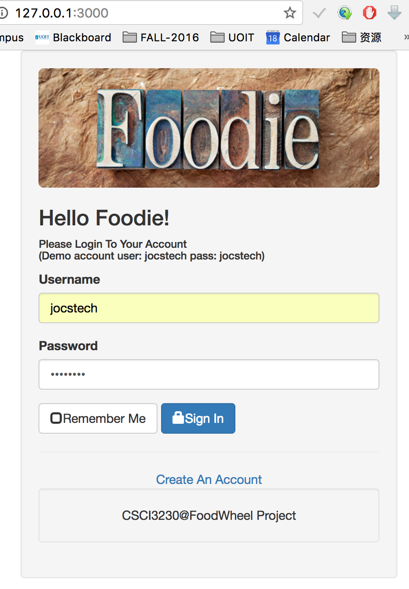
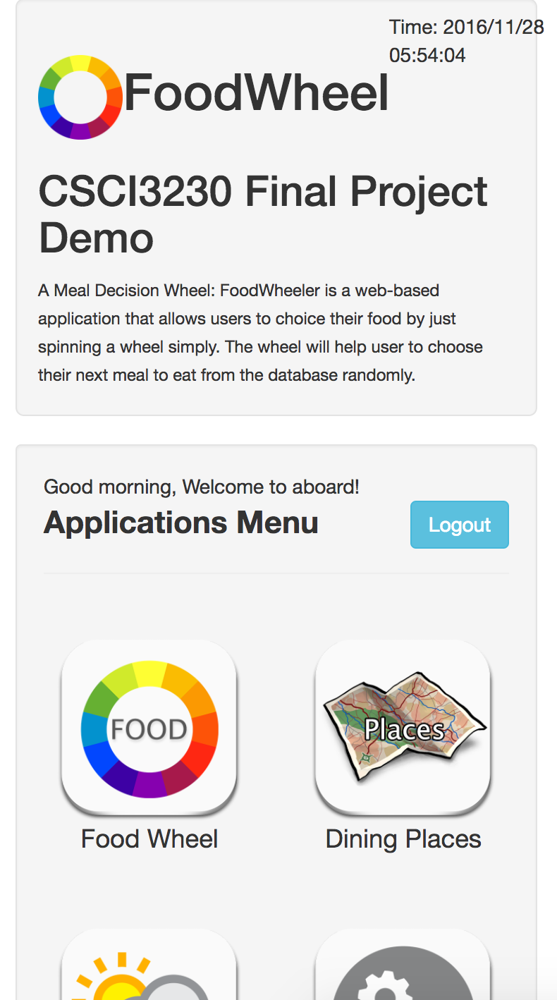
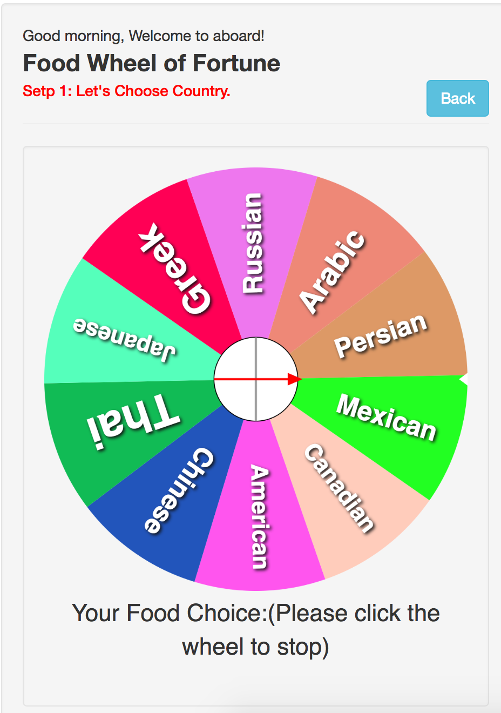
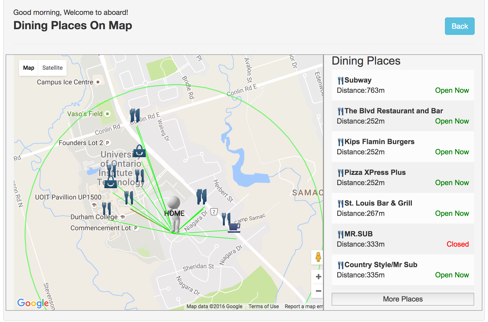
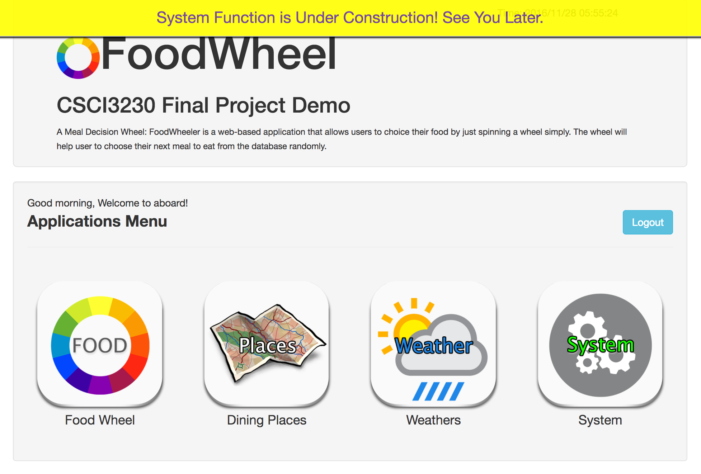

# Web Application Project Fall 2016
##Web application final project repo


#### Made by Group:
Name			|Student Number
:-------------|---------------
Yulong Fang	|100471536
Moe Savari	|100604449 


##Introduction:

###A Dinning Decision Maker Web App: FoodWheel

Feature:

1. Fully responsive mobile first web application
2. Lightweight system structure

FoodWheel is a web-based(Node.js) application that allows users to choice their food by just spinning a wheel simply. The wheel will help user to choose their next meal to eat from the database randomly.

##Screenshots:

####Login System:

####Application Home Page:

####Food Wheel:

####Geocoding Map Places:

####Desktop View Home Page:


##Configuration(Installation):
```
* Required Running Environments

* Nodejs <6.9.1+>
* MongoDB <3.2.10+>
```

####Installation Steps:

1. <mark>**Git Clone/Download**</mark> this repository to your local disk.
2. <mark>**Unzip**</mark> the zip file if you downloaded it.
1.	Open a <mark>**Terminal**</mark> application.
2. from github website.
2. <mark>**'CD'**</mark> to the path to root of project folder.
3. Type <mark>**'npm install'**</mark> in the terminal.
4. Type <mark>**'node index'**</mark> in the terminal.
5. Open a web browser and go to <http://127.0.0.1:3000> or <http://localhost:3000> to see the project.


##Web Techniques Applied

1. HTML/HTML5/CSS
2. DOM/Dynamic HTML
3. AJAX/JSON/XML
2. JavaScript
3. Bootsrap
4. JQuery
5. JQueryUI
6. Node.js
7. MongoDB/Mongoose
8. SVG
8. D3